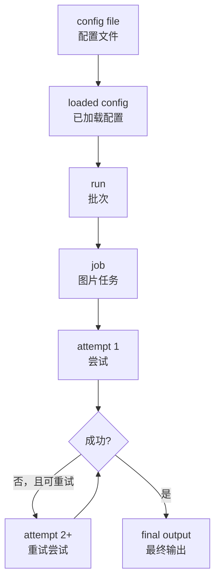
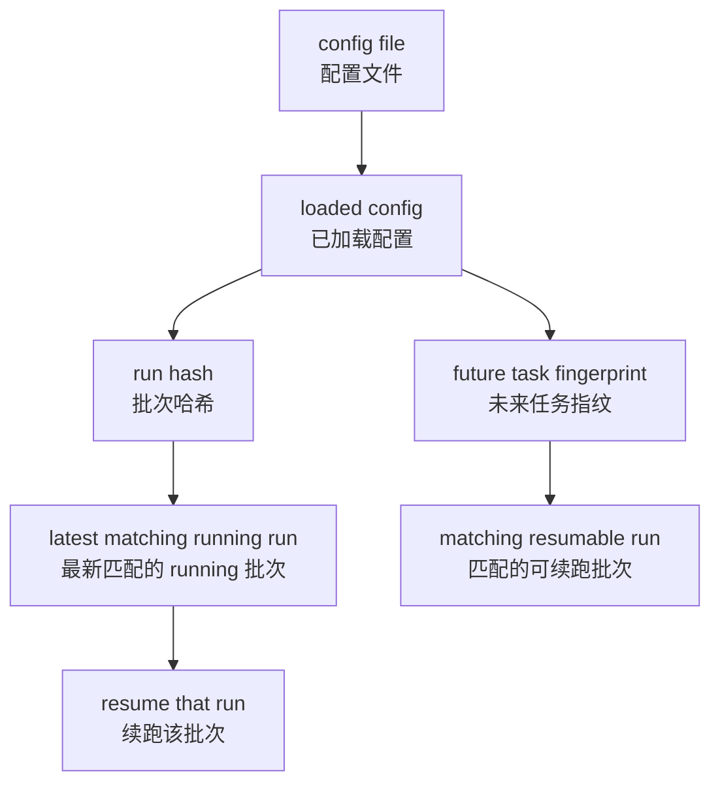

# 术语表

本文件定义项目中的固定术语。除非有明确重构决策，否则代码、文档、CLI 文案和后续 Web UI 设计都应遵循这里的定义。

## 配置术语

- `config file`（配置文件）：磁盘上的 YAML 配置文件。
- `loaded config`（已加载配置）：程序实际执行时使用的最终配置，等于 defaults、YAML 和 CLI 参数合并后的结果。
- `run identity`（批次身份）：用于判断两次执行是否属于同一个可续跑批次的稳定输入集合。
- `run hash`（批次哈希）：基于 `run identity` 计算出的哈希；当前自动续跑规则使用它匹配可续跑批次，SQLite 中对应 `runs.run_hash`。
- `run config snapshot`（批次配置快照）：创建 run 时保存的脱敏 `loaded config` 快照，用于未来在原配置文件丢失时按 run id 恢复执行。
- `config version`（配置版本）：配置 schema 版本号，用于校验与显式升级。

## 执行术语

- `run`：程序内部的批次执行实体。当前代码、数据库和 CLI 已广泛使用该名称。
- `run status`：`run` 的持久化状态，例如 `running`、`completed`、`failed`。
- `job`（图片任务）：批次内针对单张输入图片创建的最小持久化执行单元。
- `job status`（任务状态）：`job` 的持久化状态，例如 `pending`、`retryable`、`succeeded`。
- `attempt`（尝试）：某个 `job` 的一次具体执行尝试，通常对应一次 API 请求。
- `attempt status`（尝试状态）：单次 `attempt` 的结果状态，例如 `succeeded`、`retryable`、`failed`。

## API 访问术语

- `provider`（供应商）：API 账号或凭据所属的服务提供方，例如 OpenAI、OpenRouter。它描述“凭据归属”和“账户能力管理”这类运营层概念。
- `adapter`（适配器）：本地代码中的 API 接口接入实现，负责定义请求路径、请求参数组织方式、响应解析方式以及兼容逻辑。当前实现的 `openai`、`gpt2api`、`pic2api` 都属于 adapter。
- `base URL`（基础地址）：当前请求所使用的 API 基础地址。
- `model`（模型）：远端图像模型名称，例如 `gpt-image-2`。
- `API key`（API 凭据）：访问 API 服务的密钥。
- `key source`（密钥来源）：本次批次所用 API key 的来源，例如 `openai.apiKey` 或 `openai.apiKeyEnv`。
- `key slot`（密钥槽位）：为未来多 key 调度保留的非敏感逻辑身份，不代表真实 secret。

边界约定：

- `provider` 关注“账号归属、额度、代理、健康度、路由策略”等运营层概念。
- `adapter` 关注“请求走哪个路径、字段怎么拼、响应怎么解”的接口层概念。

## 输出与处理术语

- `planned output path`（规划输出路径）：收到 API 成功响应前，程序为该 `job` 预先规划的输出路径。
- `final output`（最终输出）：对用户可见的最终输出文件。
- `intermediate output`（中间输出）：为了诊断或后处理而保留的非最终输出，例如 crop-back 前保留的未裁剪 API 输出。
- `processing metadata`（处理元数据）：预处理与后处理相关的附加元数据，用于查询和诊断。

## 调度与续跑术语

- `queue`（队列）：持久化并推进 `job` 状态的执行系统。
- `scheduler`（调度器）：决定何时启动可执行 `job`、未来还可能决定使用哪个 provider 或 key slot 的逻辑。
- `resume`（续跑）：继续未完成的批次。
- `resumable run`（可续跑批次）：仍有未完成工作、后续可以继续的 `run`。
- `cooldown`（冷却）：在 retryable 失败后，继续调度新的 `job` 前需要等待的时间窗口。
- `success limit`（成功上限）：`translate --max-success <n>` 触发的 CLI 级停止条件。

## 命名规则

- 执行层级固定为 `run > job > attempt`。
- 中文对外文案推荐使用 `批次 > 图片任务 > 尝试`。
- `provider` 与 `adapter` 分别对应运营/账号归属层与接口协议接入层。
- `config file`、`loaded config` 与 `run identity` 必须严格区分，讨论 hash、resume、匹配规则时不能混用。
- 当前配置中的 `openai.adapter` 字段承载 adapter 选择；`openai`、`gpt2api`、`pic2api` 是当前支持的 adapter 标识。

## 生命周期

### 主执行生命周期

### 当前续跑匹配与未来演进

